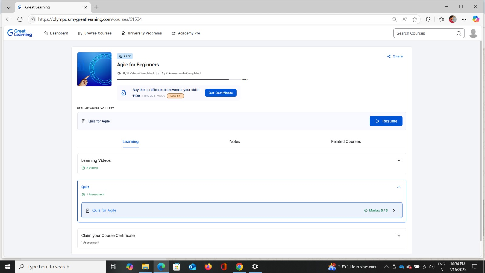
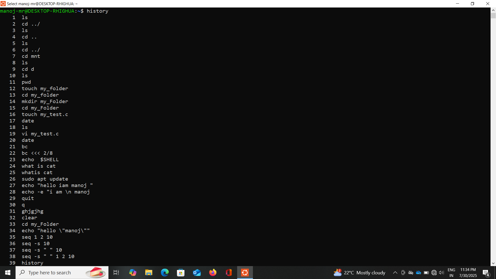
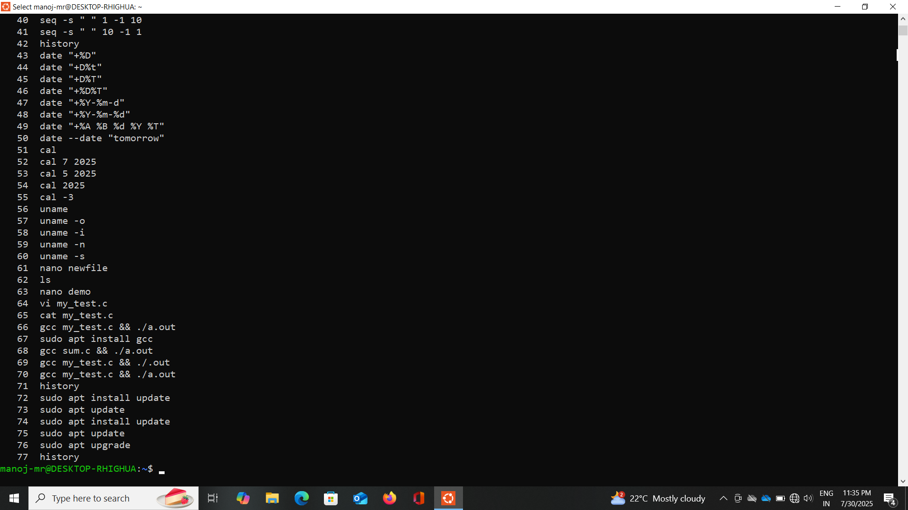
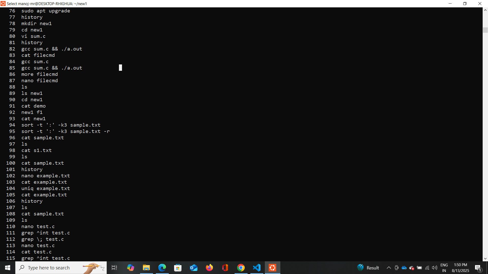
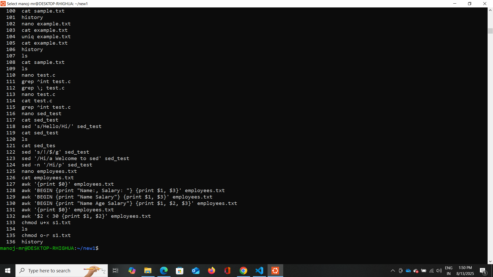

 5184095_Manoj_MR
 ---
 ## 📚 Overview

Welcome to my repository! This is a comprehensive record of my learning journey through:

- **📘 SDLC (Software Development Life Cycle)**
- **🛠️ Git & Version Control**
- **🐧 Linux Command Line**
- **💻 C Programming Fundamentals**
- **🧪 Unit Testing with Unity Framework**

It contains **certificates**, **hands-on exercises**, and **practical command-line tasks** to showcase my progress and skills.

---
## 🧭 Repository Navigation

Explore the repository for detailed content:
 

<a href="#1" style="color:white; text-decoration:none; margin: 0 20px; font-weight:bold; font-size:18px;">🛠️ SDLC</a>

<a href="#2" style="color:white; text-decoration:none; margin: 0 20px; font-weight:bold; font-size:18px;">🌱 GIT</a>

<a href="#3" style="color:white; text-decoration:none; margin: 0 20px; font-weight:bold; font-size:18px;">💻 LINUX</a>

<a href="#4" style="color:white; text-decoration:none; margin: 0 20px; font-weight:bold; font-size:18px;">⚡ C PROGRAMMING</a>

<section id="1">
 ## [✔️] Agile Completion
  

  

 </section>
 <section id="2">
 ## [✔️] Git training completion

  
 </section>
 <section id="3"> 
 ## [✔️] Linux Commends

  

 

  

 

  

 

  
 </section>
   <section id="4"> 
 ## [✔️] C completion
  

  

 
  

  

  </section>
 
